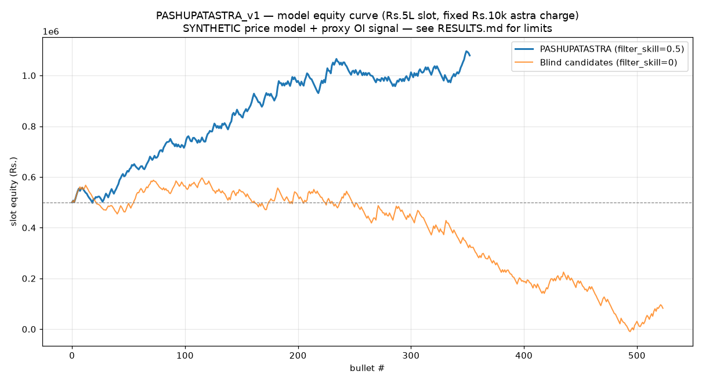

# PASHUPATASTRA_v1 — Complete Backtest Report (Detailed)

*Generated by `backtest_pashupatastra.py` · 16 seeds · book-2× + re-entry · conviction default = sniper.*

> **What this is:** a faithful simulation of the strategy's mechanics, sizing, exit,
> costs and frequency on a regime-calibrated **synthetic** NIFTY path, with the OI
> signal's selectivity exposed as a swept parameter. **It is not a realized track
> record.** The decision-grade outputs are the frontier (§7) and target analysis (§8);
> the real edge needs recorded option-chain OI to confirm (see RESULTS.md / V2 doc).

## 1. Run parameters

| Field | Value |
|---|---|
| Data source | SYNTHETIC calibrated NIFTY model (2025-26 anchors estimated) |
| Period | 2020-01-01 → 2026-06-30  (6.49 yrs) |
| Seeds (Monte-Carlo) | 16 |
| Capital slot | Rs.500,000 |
| Astra charge (risk/bullet) | Rs.10,000 (2% of slot) |
| NIFTY lot | 65 |
| Exit ladder | book 85% @ 2×, 10% @ 4×, 5% runner |
| Re-entry | up to 4/expiry |
| Variance risk premium | 45% (+50% on 0DTE) |
| Headline signal assumption | filter_skill=0.5 |

## 2. Methodology (one paragraph)

Regime-calibrated NIFTY path (real year-end anchors thru 2024; 2025–26 estimated),
generated as a **strictly causal** intraday walk (the afternoon cannot see the morning).
Options priced Black-Scholes at **IV above realized vol** (the seller's variance-risk-
premium edge). Each candidate is simulated entry→ladder→runner with the **full Indian
cost model** (Rs.20/order, STT 0.10% sell, GST, premium-scaled spread). The **OI signal**
is modeled as `filter_skill` = fraction of losing candidates avoided, and swept.

## 3. Headline scorecard (mean ± std over 16 seeds, filter_skill=0.5)

| Metric | Value |
|---|---|
| Bullets (total) | 354 ± 20 |
| Bullets / month | 4.55 ± 0.26 |
| Win rate | 52.5 ± 2.6 % |
| Total net P&L | Rs.792,142 ± 301,081 |
| Return on slot (period) | 158.4 ± 60.2 % |
| Avg annual return on slot | 24.4 ± 9.3 % |
| Expectancy / bullet | 0.221 ± 0.076 R |
| Profit factor | 1.63 ± 0.26 |
| Max drawdown | 21.1 ± 6.3 % of slot |
| Longest losing streak | 8 ± 3 bullets |
| Option PEAK ≥10× (raw tail) | 3.4 ± 1.9 per run |
| Best raw option multiple | 16.0 ± 4.5× |

**Blind control** (no OI filter): return -19% · win 39.6% · expectancy -0.019R — the floor the signal must beat.

## 4. Trade distribution (seed-0 sample, n=352)

| Return-on-capital bucket | # trades | % |
|---|---|---|
| total loss (R≈-1) | 96 | 27% |
| loss (-1<R<0) | 76 | 22% |
| small win (0≤R<1) | 74 | 21% |
| 1–3R | 104 | 30% |
| 3–5R | 2 | 1% |
| 5R+ | 0 | 0% |

| Exit reason | # | Gross winners | Gross losers | Avg cost/bullet |
|---|---|---|---|---|
| EXPIRY:269 / TRAIL:70 / EOD:13 |  | Rs.1,889,558 | Rs.-1,310,561 | Rs.9,158 |

## 5. Per-setup attribution (seed 0)

| Setup | Trades | Win% | Net P&L |
|---|---|---|---|
| A | 339 | 51.0% | Rs.564,351 |
| C | 11 | 45.5% | Rs.-772 |
| D | 2 | 100.0% | Rs.15,418 |

## 6. Per-year P&L (seed 0)

| Year | Net P&L |
|---|---|
| 2020 | Rs.240,067 |
| 2021 | Rs.105,382 |
| 2022 | Rs.142,045 |
| 2023 | Rs.32,390 |
| 2024 | Rs.-26,938 |
| 2025 | Rs.-763 |
| 2026 | Rs.86,808 |

## 7. Conviction tiers (book-2× + re-entry) — the core doctrine

| Tier | trades/yr | win% | exp.R | Ann.return@2% risk | @5% (DD) | best raw mult |
|---|---|---|---|---|---|---|
| Broad | 54.6 | 52.6% | +0.26 | +28% | +71% (40%) | 18.7× |
| Selective | 45.9 | 61.2% | +0.44 | +40% | +101% (22%) | 19.3× |
| Sniper | 38.6 | 72.3% | +0.68 | +52% | +131% (18%) | 16.2× |
| Assassin | 35.7 | 78.7% | +0.80 | +57% | +143% (14%) | 18.9× |

*Annual return is NON-compounded (linear, liquidity-realistic). Real compounding is
across years (~50%/yr → 1.5⁵ = 7.6× per slot in 5y).*

## 8. Profitability frontier — seller VRP edge × our signal skill (return-on-slot %)

| Seller edge \\ signal skill | 0.0 | 0.4 | 0.6 | 0.8 |
|---|---|---|---|---|
| Low (vrp 0.2) | 401% | 451% | 538% | 632% |
| Med (vrp 0.35) | 124% | 227% | 317% | 420% |
| High (vrp 0.5) | -54% | 73% | 170% | 288% |
| Extreme (vrp 0.7) | -204% | -63% | 45% | 148% |

## 9. Target analysis — what it takes to hit win≥80% / 40%-per-yr-on-slot

| signal skill | book-2× win% | scalp win% | Ann.return@5% (DD) |
|---|---|---|---|
| 0.5 | 50.3% | 60.5% | +61% (46%) |
| 0.6 | 55.6% | 65.5% | +83% (36%) |
| 0.7 | 63.0% | 71.9% | +108% (23%) |
| 0.8 | 71.0% | 79.0% | +129% (19%) |
| 0.9 | 83.0% | 88.5% | +154% (12%) |

- **80% win** needs signal skill ≈ 0.9 (scalp) / 0.9 (book-2×) — 80% is the *seller's* number; a buyer
  approaches it only via extreme selectivity + a strong, **unproven** OI signal.
- **40%/yr on slot** needs signal skill ≈ 0.5 at 5% risk.

## 10. Honest limitations

1. **No historical OI** → the ΔOI-flip trigger is proxied by price; `filter_skill` is
   assumed, not measured. This is the one thing that decides real viability.
2. **Synthetic price path** (2025–26 anchors estimated) — validates *shape*, not a track record.
3. **Intraday-only holds** — ignores multi-day continuation (conservative).
4. Per-trade compounding is liquidity-bounded; we report linear annual return, compound across years.

→ See `RESULTS.md` for the full narrative and `V2_REENGINEERED.md` §2 for the OI-recorder
  measurement loop that converts the assumption into a measured number.